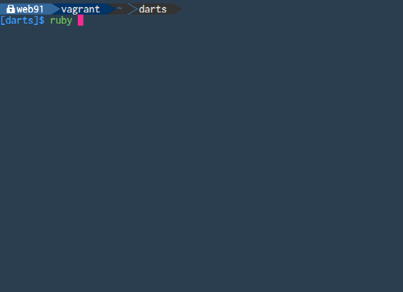

# ダーツ自宅練習用スクリプト

rubyの実践勉強とダーツのモチベーション維持のために作ってみました

自宅練習時のスコア管理用

## CLIから得点をスペース区切りで入力

- 起動

```
ruby darts.rb [countup|cricketcountup]
```



- 例

```
# 19トリプル,20ダブル,18シングル
19t 20d 18
# ブル ダブルブル 1シングル
50 50d 1
```

## データの保存
- 結果をjsonへ保存

# data.json

```
[
  {"award":{"S-BULL":4,"D-BULL":1},"date":"2016-03-08","game":"countup","score":467},
  {"award":{"D-BULL":2},"date":"2016-03-08","game":"countup","score":368}
]
```

# TODO
- スコアの可視化
    - tooltipのstyle
- クリケットの実装
- 01の実装


